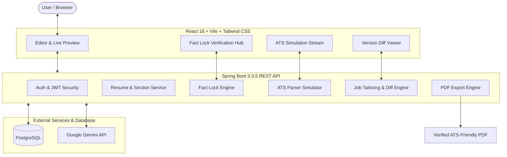

# VeriResume — Grounded AI Resume Assistant

> **AI-powered resume assistant with Fact Lock anti-hallucination verification, job tailoring, and ATS Reality Check parsing simulation.**

[](https://spring.io/projects/spring-boot)
[](https://www.oracle.com/java/)
[](https://reactjs.org/)
[](https://vitejs.dev/)
[](https://tailwindcss.com/)
[](https://www.postgresql.org/)
[](https://ai.google.dev/)

---

## 🌟 Overview

Most AI resume tools invent ungrounded accomplishments, fabricate metrics (e.g., *"increased revenue by 80%"*), or introduce complex formatting tables that break Applicant Tracking Systems (ATS).

**VeriResume** solves this with two foundational pillars:
1. **🛡️ Fact Lock Anti-Hallucination Engine:** Maps every generated bullet point directly to user-supplied source facts. Unverified claims are prominently flagged for review and excluded from the final export until approved.
2. **📊 ATS Reality Check Simulation:** Simulates raw plain-text ATS parser streams, calculates a 0–100 compatibility score, and warns of formatting issues before you apply.

---

## 🏛️ System Architecture



---

## 🚀 Key Features

* **Conversational to Grounded Bullets:** Write your work and project experience in natural language. Gemini extracts factual grounding statements and transforms them into strong action bullets.
* **Fact Lock Hub:** Interactive verification meter calculating `% Grounded`, claim status pills (`VERIFIED`, `UNVERIFIED`, `USER_CONFIRMED`, `REJECTED`), and inline editing.
* **ATS Reality Check:** Side-by-side split screen comparing recruiter visual layout against plain-text scanner output with 0–100 readability scoring.
* **Job Description Tailoring & Diff:** Analyzes target JDs, computes match indicators, and non-destructively produces tailored version snapshots with side-by-side diffs.
* **4 ATS-Optimized Templates:** Clean, single-column layouts designed for flawless machine parsing (`Modern`, `Classic`, `Minimal`, `Technical`).
* **Pre-Flight Review & Verified PDF Export:** Comprehensive pre-export audit and 1-click server-side PDF generation.

---

## 🛠️ Tech Stack

### Backend
* **Language/Runtime:** Java 21
* **Framework:** Spring Boot 3.3.5 (Spring Web, Spring Security, Spring Data JPA)
* **Authentication:** Stateless JWT (HMAC-SHA512)
* **Database:** PostgreSQL 16
* **AI Integration:** Google Gemini REST API
* **PDF Rendering:** OpenHTMLToPDF / Flying Saucer & Thymeleaf
* **Documentation:** SpringDoc OpenAPI 3 / Swagger UI

### Frontend
* **Runtime/Bundler:** Node.js 18+ & Vite 6
* **Framework:** React 18 & React Router 6
* **Styling:** Vanilla Tailwind CSS with custom dark slate design tokens
* **Icons:** Lucide React
* **HTTP Client:** Axios with JWT request/response interceptors

---

## 🏁 Quick Start Guide

### Prerequisites
* **Java 21 JDK**
* **Maven 3.9+** (or use backend Maven wrapper)
* **Node.js 18+ & npm**
* **Docker & Docker Compose** (for PostgreSQL)

---

### 1. Clone the Repository
```bash
git clone https://github.com/manikandanmp27/verita-ai-resume.git
cd verita-ai-resume
```

---

### 2. Start PostgreSQL Database
```bash
cd backend
docker compose up -d
```
*PostgreSQL will be running on `localhost:5432` with database `verita_db`.*

---

### 3. Configure Backend Environment
Edit `backend/src/main/resources/application.properties` or set environment variables:
```properties
# Database
spring.datasource.url=jdbc:postgresql://localhost:5432/verita_db
spring.datasource.username=verita_user
spring.datasource.password=verita_password

# JWT Security
jwt.secret=9a8b7c6d5e4f3a2b1c0d9e8f7a6b5c4d3e2f1a0b9c8d7e6f5a4b3c2d1e0f9a8b7c6d5e4f3a2b1c0d9e8f7a6b5c4d3e2f1a0b9c8d7e6f5a4b3c2d1e0f9a8b7c6d5e4f3a2b1
jwt.expiration=86400000

# Google Gemini API
gemini.api.key=YOUR_GEMINI_API_KEY_HERE
```

Run the backend:
```bash
cd backend
mvn spring-boot:run
```
*Backend runs on `http://localhost:8080`.*
*Swagger UI available at `http://localhost:8080/swagger-ui.html`.*

---

### 4. Start the Frontend
```bash
cd frontend
npm install
npm run dev
```
*Frontend runs on `http://localhost:5173` with automatic `/api` proxying to `http://localhost:8080`.*

---

## 📖 API Endpoints Summary

| Module | Method | Endpoint | Description |
| :--- | :--- | :--- | :--- |
| **Auth** | `POST` | `/api/auth/register` | Register new user |
| **Auth** | `POST` | `/api/auth/login` | Authenticate & receive JWT |
| **Auth** | `GET` | `/api/auth/me` | Fetch current authenticated user |
| **Profile** | `GET` / `PUT` | `/api/profile` | Get or update career profile |
| **Resumes** | `GET` / `POST` | `/api/resumes` | List or create resumes |
| **Resumes** | `GET` / `PUT` | `/api/resumes/{id}/content` | Get or update structured content |
| **AI** | `POST` | `/api/resumes/{id}/generate` | Generate grounded bullets & Fact Lock claims |
| **AI** | `POST` | `/api/resumes/{id}/improve` | Polish text bullet with rationale |
| **Fact Lock** | `GET` | `/api/resumes/{id}/claims` | Get Fact Lock verification overview |
| **Fact Lock** | `POST` | `/api/resumes/{id}/claims/{claimId}/verify` | Confirm and verify claim |
| **Fact Lock** | `POST` | `/api/resumes/{id}/claims/{claimId}/reject` | Reject hallucinated claim |
| **Job Tailor** | `POST` | `/api/jobs/analyze` | Analyze Job Description requirements |
| **Job Tailor** | `POST` | `/api/resumes/{id}/tailor` | Generate tailored resume snapshot |
| **ATS Check** | `POST` | `/api/resumes/{id}/ats-check` | Run simulated ATS parsing check |
| **Export** | `POST` | `/api/resumes/{id}/export` | Download verified ATS-ready PDF |

---

## 🔒 Fact Lock Grounding Matrix

| Claim Status | Meaning | Included in PDF Export? |
| :--- | :--- | :---: |
| `VERIFIED` | Traceable directly to natural-language user facts | **Yes** |
| `USER_CONFIRMED` | Approved manually by user after review | **Yes** |
| `UNVERIFIED` | Metric or skill not found in initial input | **Flagged** |
| `REJECTED` | Identified as hallucination / excluded | **No** |

---

## 📜 License

This project is licensed under the Apache License 2.0.
