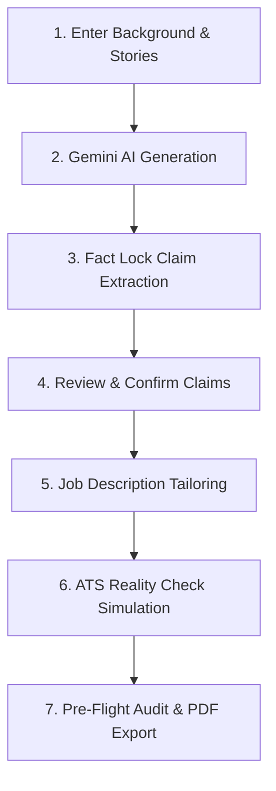

# VeriResume — Grounded AI Resume Assistant

> **An AI-powered resume platform featuring Fact Lock anti-hallucination grounding, job description tailoring, ATS Reality Check parsing simulation, and secure Firebase Authentication.**

[](https://spring.io/projects/spring-boot)
[](https://www.oracle.com/java/)
[](https://reactjs.org/)
[](https://vitejs.dev/)
[](https://firebase.google.com/)
[](https://www.postgresql.org/)
[](https://ai.google.dev/)

---

## 🌟 Overview

**VeriResume** is an intelligent resume assistant engineered for technical professionals, job seekers, and career changers. It transforms conversational, natural-language project and work stories into structured, recruiter-ready resumes while actively preventing AI hallucinations and optimizing for machine readability.

---

## 🛑 Problem Statement

Modern job seekers face two major obstacles when leveraging generic AI tools to write resumes:

1. **AI Hallucinations & Fabricated Claims:** Generic ChatGPT wrappers often invent fake accomplishments, exaggerate metrics (e.g., *"increased revenue by 300%"*), or insert technologies the candidate never used. When pressed during technical interviews, candidates struggle to defend these fabricated claims.
2. **ATS Parser Rejections:** Many online resume builders generate visually complex, multi-column templates with tables, text boxes, and graphics. Enterprise Applicant Tracking Systems (ATS) struggle to parse these formats, resulting in garbled text, missed keywords, and automated rejections.

---

## 💡 Solution

VeriResume introduces a dual-pillar approach to resume creation:

1. **🛡️ Fact Lock Anti-Hallucination Engine:** Every generated bullet point is deconstructed into atomic factual claims cross-referenced against user-provided background evidence. Unverified claims require explicit user approval and are automatically excluded from exports if rejected.
2. **📊 ATS Reality Check Simulation:** A live simulation of enterprise ATS text-extraction algorithms that strips styling, displays the raw plain-text scanner output, and evaluates readability with a 0–100 score.

---

## 🚀 Key Features

* **Natural-Language to Action Bullets:** Write casual stories about your projects; Google Gemini converts them into strong action-verb bullet points (*Architected*, *Engineered*, *Optimized*).
* **Fact Lock Grounding Hub:** Real-time Grounding Verification Meter (% Grounded), categorized claim cards (*Metric*, *Technology*, *Responsibility*), and source facts evidence drawer.
* **AI Content Polishing:** Single-bullet enhancement modal with grounding checks and transparent AI recruiter reasoning.
* **Job Description Analyzer & Tailoring:** Extracts target skills, calculates match scores, and non-destructively creates tailored version snapshots.
* **Interactive Diff Engine:** Side-by-side visual diff showing additions (green), modifications (blue), and removals (red) with AI change rationale.
* **ATS Reality Check Simulation:** Split-screen view comparing styled recruiter layout against raw plain-text scanner stream with header detection diagnostics.
* **4 ATS-Optimized Templates:** Single-column, machine-readable layouts (`Modern Header`, `Classic Executive`, `Minimal Clean`, `Technical Developer`).
* **Pre-Flight Audit & Verified PDF Export:** Automated pre-export checklist and server-side PDF generation using Flying Saucer / OpenPDF.
* **Secure Firebase Authentication:** Secure client session management with server-side cryptographic ID token verification in Spring Boot.

---

## ⚙️ How VeriResume Works



1. **Input:** The user enters profile details and writes project/work experience in plain conversational language.
2. **Grounded Generation:** Google Gemini transforms stories into professional bullets while extracting atomic claims.
3. **Fact Lock Audit:** The system classifies claims as `VERIFIED` or `UNVERIFIED`. The user approves or rejects claims.
4. **Tailoring:** The user pastes a job description to generate a tailored snapshot with visual diffs.
5. **ATS Simulation:** The user reviews how ATS parsers read the text stream and checks the 0–100 readability score.
6. **Export:** A server-side PDF engine compiles the verified content into a clean, single-column document.

---

## 🛡️ Fact Lock

Fact Lock is VeriResume's anti-hallucination verification matrix:

* **Atomic Claim Extraction:** Deconstructs generated bullets into specific technical statements, metrics, and responsibilities.
* **Verification Lifecycle:** Claims are tracked through states: `UNVERIFIED` $\rightarrow$ `USER_CONFIRMED` or `REJECTED`.
* **Grounding Metric:** Computes the percentage of claims supported by user evidence:
  $$\text{Grounding Score} = \frac{\text{Verified Claims} + \text{User Confirmed Claims}}{\text{Total Claims}} \times 100\%$$
* **Export Omission Guarantee:** Any claim rejected by the user is **automatically omitted** from the final rendered PDF.

---

## 📊 ATS Reality Check

The ATS Reality Check is an automated simulation tool:

* **Raw Text Stream:** Shows exactly what automated parsers extract by stripping HTML/CSS layout rules.
* **Readability Scoring (0–100):** Evaluates section header detection (*Experience*, *Education*, *Skills*), contact information completeness, and date format consistency.
* **Diagnostics Checklist:** Identifies non-standard headings, missing keywords, and formatting risks before applying to jobs.

---

## 🤖 AI Integration

* **Model:** Google Gemini 1.5 Flash via server-side REST integration.
* **Security:** API keys are stored exclusively in backend environment variables and are never exposed to the client.
* **Prompt Engineering:** Enforces structured JSON schemas, action-verb starts, and strict prohibition of fabricated statistics.
* **Tasks Powered by AI:**
  1. Full resume generation from conversational stories.
  2. Single-bullet refinement with recruiter rationale.
  3. Job description keyword and qualification extraction.
  4. Non-destructive job tailoring with structured changelog diffs.

---

## 🛠️ Technology Stack

| Layer | Technologies |
| :--- | :--- |
| **Frontend** | React 18, Vite 6, Tailwind CSS, Lucide Icons, Axios |
| **Backend** | Java 21 / 24, Spring Boot 3.3.5 (Spring Web, Security, Data JPA) |
| **Database** | PostgreSQL 16 (with in-memory H2 profile for instant local development) |
| **Authentication** | Firebase Authentication (Client SDK + Server-Side Admin/Token Filter) |
| **AI Engine** | Google Gemini 1.5 Flash REST API |
| **PDF Rendering** | OpenHTMLToPDF / Flying Saucer & Thymeleaf with Alpine font packages |
| **Deployment** | Vercel (Frontend SPA) + Render (Spring Boot Docker Web Service & PostgreSQL) |

---

## 🏛️ Architecture

```text
User / Web Browser
       │
       ▼
React 18 + Vite (Vercel)
       │  (HTTPS / Dynamic Firebase ID Token)
       ▼
Spring Boot 3.3.5 REST API (Render)
       ├── FirebaseAuthenticationFilter (Server-Side ID Token Verification)
       ├── PostgreSQL 16 (Relational Entity Storage & User Isolation)
       ├── Google Gemini 1.5 Flash API (Grounded AI Engine)
       └── Flying Saucer / OpenPDF (Server-Side PDF Rendering)
```

For full architectural details and entity diagrams, refer to [`resources/architecture.md`](./resources/architecture.md).

---

## 📂 Project Structure

```text
veriresume/
├── backend/                        # Spring Boot 3.3.5 Application
│   ├── src/main/java/com/verita/
│   │   ├── config/                 # Security, Database, CORS, Firebase, OpenAPI
│   │   ├── controller/             # REST API Controllers (13 endpoints)
│   │   ├── dto/                    # Request/Response DTOs & content schemas
│   │   ├── entity/                 # JPA Entities (User, Resume, Version, Claim, etc.)
│   │   ├── repository/             # Spring Data JPA Repositories
│   │   ├── security/               # Firebase Token Filter & UserPrincipal
│   │   ├── service/                # Core Business Services (AI, FactLock, ATS, PDF)
│   │   └── util/                   # JsonUtils & Jackson helpers
│   ├── src/main/resources/
│   │   ├── application.yml         # Base configuration (dynamic PORT & DB URL)
│   │   ├── application-dev.yml     # Local dev profile (in-memory H2)
│   │   ├── application-prod.yml    # Production profile (PostgreSQL)
│   │   └── templates/              # 4 Thymeleaf PDF Templates
│   ├── Dockerfile                  # Production Multi-stage Dockerfile with fonts
│   └── pom.xml                     # Maven configuration & dependencies
│
├── frontend/                       # React 18 + Vite Application
│   ├── src/
│   │   ├── api/                    # Axios client with dynamic Firebase token interceptor
│   │   ├── components/             # Reusable UI, builder accordions, diffs, templates
│   │   ├── config/                 # Firebase Web SDK client initialization
│   │   ├── context/                # AuthContext & ToastContext
│   │   ├── pages/                  # Application views (Builder, FactLock, ATS, Review, etc.)
│   │   └── routes/                 # Protected route configurations
│   ├── vercel.json                 # Vercel SPA routing rewrites
│   ├── Dockerfile                  # Frontend Nginx production container
│   └── package.json                # Dependencies & Vite build scripts
│
├── resources/                      # Submission Documentation & Guides
│   ├── architecture.md             # Technical architecture & design write-up
│   ├── submission-checklist.md     # GenForge challenge verification checklist
│   └── doc_info.md                 # Demonstration walkthrough guide & sample data
│
├── docker-compose.yml              # Multi-container orchestration (Local Dev)
├── render.yaml                     # Render Infrastructure-as-Code Blueprint
├── vercel.json                     # Root Vercel configuration
└── README.md                       # Main project documentation
```

---

## 📋 Prerequisites

* **Java Development Kit (JDK):** Version 21 or 24
* **Node.js:** Version 18+ & **npm**
* **Google Gemini API Key:** Free key from [Google AI Studio](https://aistudio.google.com/)
* **Firebase Account:** Free project from [Firebase Console](https://console.firebase.google.com/)
* *(Optional)* **Docker Desktop:** For containerized local development

---

## 🔑 Environment Variables

### Frontend (`frontend/.env`)
```properties
VITE_API_BASE_URL=/api

# Firebase Web Client Configuration
VITE_FIREBASE_API_KEY=AIzaSy...
VITE_FIREBASE_AUTH_DOMAIN=your-project.firebaseapp.com
VITE_FIREBASE_PROJECT_ID=your-project
VITE_FIREBASE_STORAGE_BUCKET=your-project.firebasestorage.app
VITE_FIREBASE_MESSAGING_SENDER_ID=123456789012
VITE_FIREBASE_APP_ID=1:123456789012:web:abcdef123456
```

### Backend (`backend/.env`)
```properties
# Database Configuration (PostgreSQL in Prod, H2 in Dev)
SPRING_DATASOURCE_URL=jdbc:postgresql://localhost:5432/verita_db
SPRING_DATASOURCE_USERNAME=verita_user
SPRING_DATASOURCE_PASSWORD=verita_password

# JWT Secret
JWT_SECRET=404E635266556A586E3272357538782F413F4428472B4B6250645367566B5970

# Google Gemini API
GEMINI_API_KEY=your_gemini_api_key_here
GEMINI_MODEL=gemini-1.5-flash-latest

# CORS Configuration
CORS_ALLOWED_ORIGINS=http://localhost:5173,https://*.vercel.app
```

---

## 💻 Local Setup

### 1. Clone the Repository
```bash
git clone https://github.com/manikandanmp27/VeriResume-ai-resume.git
cd VeriResume-ai-resume
```

### 2. Configure Environment Files
```bash
# Configure frontend
cp frontend/.env.example frontend/.env

# Configure backend
cp backend/.env.example backend/.env
```

---

## 🏃 Running the Application

### Method 1: Local Development (Instant H2 Database)

#### Terminal 1 — Start Backend
```powershell
cd backend
$env:JAVA_HOME = "C:\Program Files\Java\jdk-24" # (or your Java path)
.\mvnw.cmd spring-boot:run "-Dspring-boot.run.profiles=dev"
```
*API starts on `http://localhost:8080` with in-memory H2 database.*

#### Terminal 2 — Start Frontend
```powershell
cd frontend
npm install
npm run dev
```
*Frontend starts on `http://localhost:5173`.*

---

### Method 2: Docker Compose (Full Stack with PostgreSQL)
```bash
docker compose up --build
```

---

## 📱 Usage Guide

1. **Register / Sign In:** Navigate to `http://localhost:5173/register` and create an account.
2. **Create a Resume:** On the dashboard, click **Create New Resume**, enter a title, and select a template.
3. **Add Experience with AI:** In the Projects/Experience accordion, type a conversational story and click **"✨ AI Generate Resume"**.
4. **Audit in Fact Lock:** Open the **Fact Lock Hub** to review extracted claims, verify evidence, or reject inaccurate metrics.
5. **Tailor for a Job:** Open **Job Analysis**, paste a target job description, and click **"Tailor Resume"** to inspect visual diffs.
6. **Check ATS Readability:** Run the **ATS Reality Check** to review the plain-text parser stream and 0–100 score.
7. **Export Verified PDF:** In **Review & Export**, select your preferred layout and click **"Download Verified PDF"**.

---

## 📡 API Overview

The backend exposes RESTful endpoints documented via **Swagger / OpenAPI**:

* **Interactive Swagger UI:** `http://localhost:8080/swagger-ui.html`
* **OpenAPI 3 JSON:** `http://localhost:8080/v3/api-docs`

| Method | Endpoint | Description |
| :--- | :--- | :--- |
| `GET` | `/api/health` | Service uptime and health check probe |
| `GET` | `/api/dashboard` | Aggregated dashboard statistics |
| `GET` / `POST` | `/api/resumes` | List and create resume projects |
| `GET` / `PUT` | `/api/resumes/{id}` | Retrieve and update resume metadata |
| `POST` | `/api/resumes/{id}/generate` | AI resume generation from raw stories |
| `POST` | `/api/resumes/{id}/improve-bullet`| AI single-bullet content refinement |
| `GET` / `PATCH` | `/api/resumes/{id}/claims` | Manage Fact Lock claims and statuses |
| `POST` | `/api/resumes/{id}/job-analysis` | Analyze target job descriptions |
| `POST` | `/api/resumes/{id}/tailor` | Non-destructive resume tailoring |
| `GET` | `/api/resumes/{id}/ats-check` | Run simulated ATS parsing audit |
| `GET` | `/api/resumes/{id}/export/pdf` | Download verified, server-rendered PDF |

---

## 🔒 Authentication

* **Client:** Firebase Authentication handles user registration, password management, and session tokens.
* **Server:** Spring Security intercepts incoming requests, cryptographically verifies the Firebase ID token, and auto-provisions the local PostgreSQL user and profile.
* **Privacy:** Passwords are never sent to or stored within the PostgreSQL database.

---

## ☁️ Deployment

The application is configured for cloud deployment across **Vercel** and **Render**:

* **Backend (Render):** Docker web service configured via [`render.yaml`](./render.yaml) connected to managed PostgreSQL 16.
  * **Live Backend URL:** [`https://veriresume-backend-13iq.onrender.com`](https://veriresume-backend-13iq.onrender.com)
  * **Health Check:** [`https://veriresume-backend-13iq.onrender.com/api/health`](https://veriresume-backend-13iq.onrender.com/api/health)
* **Frontend (Vercel):** React SPA deployment with client-side routing rewrites via [`vercel.json`](./vercel.json).

---

## 🎥 Demo

Demo video: **To be added before submission**

*(A complete scene-by-scene demonstration script and copy-paste sample inputs are available in [`resources/doc_info.md`](./resources/doc_info.md)).*

---

## 🔮 Future Improvements

* **Multi-Language ATS Simulation:** Support for non-English character tokenization and localized resume formats.
* **Direct LinkedIn Profile Ingestion:** One-click import of verified career facts directly into the Fact Lock evidence drawer.
* **Automated Keyword Density Heatmaps:** Visual section-by-section breakdown of target JD keywords.
* **OAuth Social Sign-In:** One-click Google and GitHub authentication through Firebase Auth providers.

---

## 🏆 GenForge Submission

This project is submitted for the **GenForge Generative AI Mini Challenge**.

* **Repository:** [`https://github.com/manikandanmp27/VeriResume-ai-resume`](https://github.com/manikandanmp27/VeriResume-ai-resume)
* **Architecture Write-Up:** [`resources/architecture.md`](./resources/architecture.md)
* **Submission Checklist:** [`resources/submission-checklist.md`](./resources/submission-checklist.md)
* **Demo Guide & Sample Data:** [`resources/doc_info.md`](./resources/doc_info.md)
