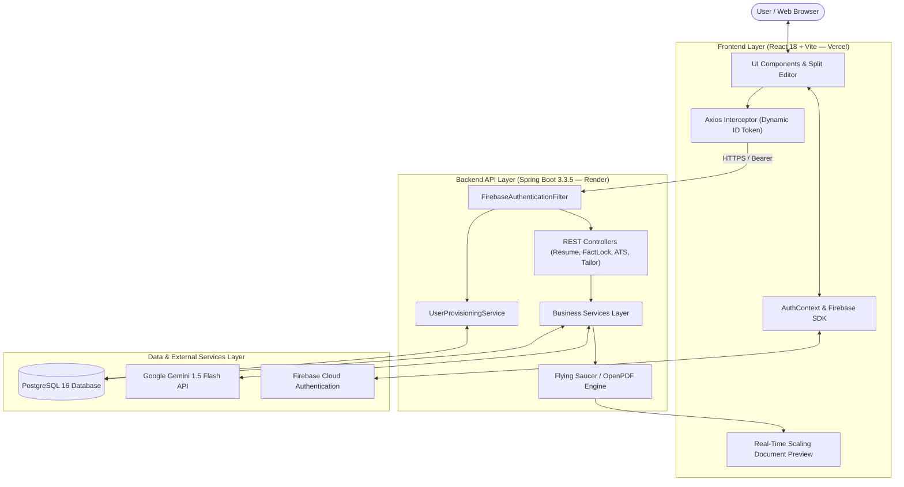
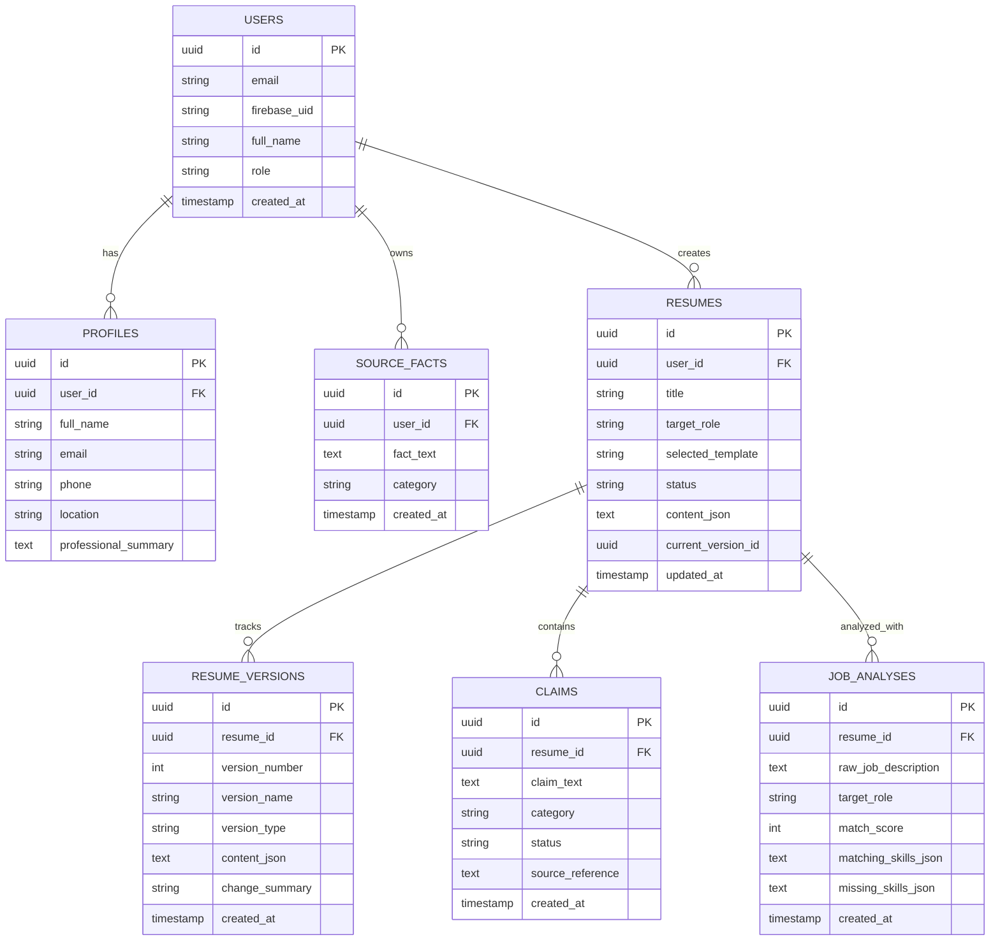
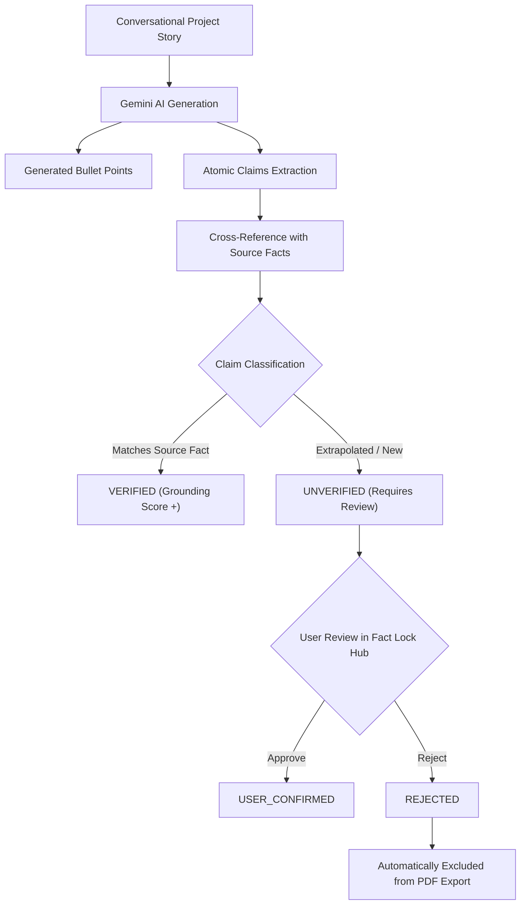

# VeriResume — Architecture & System Design Write-Up

> **Technical Architecture, AI Integration, and Design Decisions Document**  
> *Prepared for the GenForge Generative AI Mini Challenge Submission*

---

## 1. Architecture Overview

VeriResume is built as a decoupled, full-stack web application designed for high reliability, verifiable AI outputs, and ATS parser compatibility.



### High-Level Request Lifecycle
1. **User Authentication:** The client interacts directly with Firebase Authentication for identity management.
2. **Authenticated API Calls:** The frontend Axios client interceptor attaches the user's fresh Firebase ID Token as a `Bearer` token on all API requests.
3. **Server-Side Token Verification:** The Spring Boot backend interceptor (`FirebaseAuthenticationFilter`) cryptographically validates the token and maps the Firebase UID to the authoritative internal PostgreSQL `User` record.
4. **Data Isolation:** All subsequent database queries enforce strict user UUID ownership checks (`SecurityUtils.getCurrentUserId()`).
5. **Grounded AI Generation:** Requests requiring generative AI pass through prompt-engineered services connecting to Google Gemini 1.5 Flash, enforcing structured JSON schemas and fact-grounding constraints.

---

## 2. Frontend Architecture

* **Framework:** React 18 with Vite 6
* **Styling:** Vanilla Tailwind CSS with custom slate-900/brand color tokens and responsive glassmorphic components.
* **Routing:** React Router 6 with client-side SPA route protection (`<ProtectedRoute>`) and route-level code structure.
* **State Management:**
  * `AuthContext`: Manages Firebase user session, token refresh listeners (`onAuthStateChanged`), and backend profile synchronization.
  * `ToastContext`: Provides global toast notifications across all asynchronous flows.
  * Component-level reactive state for editor forms, live document rendering, and zoom scaling.
* **Key Frontend Responsibilities:**
  * **Split-Screen Workspace:** Left accordion section editor paired with right-side real-time scaled document preview.
  * **Fact Lock Hub:** Grounding verification meter, claim cards categorized by type (*Metric*, *Technology*, *Responsibility*), and source fact evidence drawer.
  * **Interactive Diff Engine:** Visual highlighting of tailored changes (green additions, blue edits, red removals) with recruiter reasoning chips.
  * **ATS Reality Check View:** Side-by-side comparison between styled recruiter layout and simulated raw plain-text ATS scanner output.

---

## 3. Backend Architecture

* **Runtime:** Java 21 / Java 24
* **Framework:** Spring Boot 3.3.5 (Spring Web, Spring Security, Spring Data JPA)
* **Design Pattern:** Layered **Controller $\rightarrow$ Service $\rightarrow$ Repository** architecture with strict separation of concerns.

```text
com.verita
├── config/             # Security, Database, CORS, Firebase, OpenAPI configurations
├── controller/         # REST API endpoints with Swagger OpenAPI annotations
├── dto/                # Request / Response data transfer objects & content schemas
├── entity/             # JPA entity models mapping PostgreSQL relational schema
├── entity/enums/       # Domain enumerations (ClaimStatus, ResumeStatus, VersionType)
├── exception/          # Centralized GlobalExceptionHandler & custom runtime exceptions
├── repository/         # Spring Data JPA repositories with custom derived queries
├── security/           # Firebase filter, token verification service, UserPrincipal
├── service/            # Core business logic (AI, Fact Lock, ATS, Tailoring, PDF)
└── util/               # JsonUtils & Jackson JSON serialization helpers
```

### Core Business Services
* `ResumeService`: Manages resume projects, metadata, lifecycle states, and version snapshots.
* `AIService` & `GeminiService`: Encapsulates Google Gemini REST API integrations, prompt templates, and response parsing.
* `ClaimExtractionService` & `FactLockService`: Deconstructs generated bullets into atomic claims, calculates grounding percentages, and enforces claim status transitions.
* `JobAnalysisService`: Analyzes target job descriptions, identifies matching/missing skills, and produces non-destructive tailored versions.
* `ATSService`: Simulates ATS plain-text parsing algorithms and calculates a 0–100 readability score.
* `ExportService`: Renders pixel-perfect, single-column ATS resumes to PDF via Thymeleaf and Flying Saucer.

---

## 4. Database Schema & Data Models

PostgreSQL 16 serves as the persistent relational datastore, ensuring strict referential integrity and cascading deletions.



---

## 5. Generative AI Integration

VeriResume integrates **Google Gemini 1.5 Flash** using server-side REST API calls. Private API keys are kept strictly on the backend and are never exposed to the client.

### AI Tasks & Prompt Architecture
1. **Conversational to Grounded Resume Generation:**
   * **Input:** User profile facts, education, skills, and conversational project/work stories written in natural language.
   * **Constraint Prompting:** Instructs Gemini to write impactful bullet points using strong action verbs (*Architected*, *Engineered*, *Optimized*) while forbidding the fabrication of ungrounded metrics.
   * **Schema Enforcement:** Forces output in strict JSON containing both structured section bullets and extracted atomic claims.
2. **Single-Bullet Content Improvement:**
   * **Input:** Target bullet point, surrounding context, and master profile facts.
   * **Output:** Proposed refined bullet, grounding verification check, and a recruiter rationale explaining why the new phrasing is more effective.
3. **Job Description Keyword Analysis:**
   * **Input:** Raw job description text.
   * **Output:** Structured role title, required skills, optional skills, experience level, and weighted match score.
4. **Non-Destructive Job Tailoring:**
   * **Input:** Master resume JSON + target Job Analysis.
   * **Output:** Tailored resume JSON + structured diff changelog (`additions`, `modifications`, `deletions`).

---

## 6. Fact Lock Anti-Hallucination Implementation

The **Fact Lock Engine** provides a structured mechanism to maintain truthfulness in AI-generated resumes:



* **Claim Lifecycle:** `UNVERIFIED` $\rightarrow$ `USER_CONFIRMED` or `REJECTED`.
* **Grounding Metric:** $\text{Grounding Score} = \frac{\text{Verified Claims} + \text{User Confirmed Claims}}{\text{Total Claims}} \times 100\%$.
* **Export Guarantee:** Any claim marked `REJECTED` by the user is automatically filtered out from the rendered resume during export, protecting candidates from awkward interview questions about fabricated statistics.

---

## 7. ATS Reality Check Implementation

The **ATS Reality Check** is an automated simulation tool that evaluates how resume content parses through applicant tracking algorithms:

* **Plain-Text Stream Extraction:** Strips presentation styling and extracts the raw plain-text token stream in reader order.
* **0–100 ATS Readability Score:** Computed based on:
  * Section Header Recognition (Standard headings like *Experience*, *Education*, *Skills* vs non-standard labels).
  * Contact Info Extraction (presence of valid email, phone number, location, and LinkedIn URLs).
  * Date Format Consistency (standardized `MMM YYYY - Present` patterns).
  * Single-Column Parser Layout Compliance (absence of multi-column tables and complex graphic blocks).
* **Diagnostics Feedback:** Highlights detected sections, extracted keywords, and formatting warnings before submission.

---

## 8. Authentication & Identity Architecture

* **Client Layer:** Firebase Web SDK handles user registration, password validation, and token acquisition.
* **Transport Layer:** Fresh Google ID tokens are sent via `Authorization: Bearer <ID_Token>`.
* **Server Verification Layer:** `FirebaseAuthenticationFilter` intercepts requests:
  * Calls `FirebaseTokenService` to verify the cryptographic token.
  * Calls `UserProvisioningService` to find or auto-provision the internal PostgreSQL `User` and initial `Profile`.
  * Establishes the Spring `SecurityContext` with `UserPrincipal`.
* **Security Benefit:** Passwords are never transmitted to or stored within the application database.

---

## 9. PDF Generation Architecture

* **Engine:** OpenHTMLToPDF / Flying Saucer (`org.xhtmlrenderer:flying-saucer-pdf-openpdf:9.9.4`) with Thymeleaf templating.
* **Font Support:** Alpine Linux runtime container includes `fontconfig` and `ttf-dejavu` packages for clean font metrics.
* **Export Pipeline:**
  1. Retrieves resume data and active version content from PostgreSQL.
  2. Applies pre-flight filtering (removes any rejected claims).
  3. Populates the selected Thymeleaf HTML template (`resume-modern.html`, `resume-classic.html`, `resume-minimal.html`, or `resume-technical.html`).
  4. Generates an ATS-compliant, single-column, selectable-text PDF binary.

---

## 10. Key Design Decisions

| Decision | Implementation | Rationale |
| :--- | :--- | :--- |
| **1. Split-Screen Builder** | React + Scaled Document Preview | Provides instant visual feedback without requiring full PDF re-renders on every keystroke. |
| **2. Fact Lock Grounding Matrix** | Structured Entity Model (`Claim` + `SourceFact`) | Moves AI resume generation away from ungrounded chat prompts to verifiable, atomic claims that the user can audit. |
| **3. Non-Destructive Job Tailoring** | `ResumeVersion` Immutable Snapshots | Allows candidates to tailor resumes for specific job descriptions while preserving their master draft. |
| **4. Server-Side AI & Token Verification** | Spring Boot 3 Security Filters | Keeps Google Gemini API keys confidential and ensures all database access is validated against authentic Firebase tokens. |
| **5. Native ATS Parser Simulation** | Regex & Token Extraction Engine | Gives users visibility into how automated recruitment systems parse their resume before submitting applications. |

---

## 11. Security Considerations

* **Stateless Security:** No server-side session state; every API request is authenticated independently via Firebase ID tokens.
* **Resource Ownership & Tenant Isolation:** Every database operation verifies that the target `resume.user_id` matches the authenticated `UserPrincipal.id`.
* **Zero Secrets in Source Control:** Database credentials, JWT secrets, and Gemini API keys are configured exclusively via environment variables.
* **Granular CORS Origins:** Spring Boot CORS is restricted via `allowedOriginPatterns` to explicitly authorized Vercel domains and local development origins.
