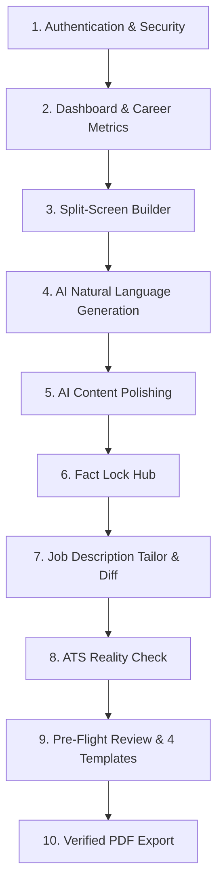

# VeriResume — Video Demonstration Guide & Feature Walkthrough

This document outlines all key features, demonstration steps, architectural explanations, and copy-paste sample data for recording a demo video of **VeriResume**.

---

## 🎯 Core Value Proposition (What Makes VeriResume Unique)

Unlike generic ChatGPT resume wrappers that invent fake metrics (e.g., *"increased revenue by 300%"*) or generate complex table layouts that get rejected by Applicant Tracking Systems (ATS), **VeriResume** is built around two core pillars:

1. **🛡️ Fact Lock Anti-Hallucination Engine:** Breaks generated text into verifiable claims, scores grounding against user evidence, and excludes unconfirmed claims from final exports.
2. **📊 ATS Reality Check Simulation:** Simulates how enterprise ATS parsers (Workday, Taleo, Greenhouse) read the resume as a plain-text stream with real-time 0–100 readability scoring.

---

## 🗺️ Step-by-Step Feature Walkthrough (What to Cover)



---

### 1. Authentication & Security
* **What to Show:**
  * Login / Registration page with Confirm Password validation and Firebase security badge.
* **How It Works Behind the Scenes:**
  * Uses **Firebase Authentication** on the client.
  * The backend **Spring Boot** server verifies incoming Google ID tokens cryptographically via `FirebaseAuthenticationFilter`.
  * Passwords are **never stored** in the PostgreSQL database.
  * Every user is isolated with UUID-based ownership checks across all database tables.

---

### 2. Dashboard & Career Metrics
* **What to Show:**
  * Overview cards: **Total Resumes**, **Fact Lock Claims** (verified vs total), **Versions Created**, and **ATS Readiness**.
  * Existing resume cards with status badges (`Draft`, `AI Generated`, `Tailored`, `Verified`), template tag, and quick-action buttons.
* **How It Works Behind the Scenes:**
  * Aggregates live database statistics across all resume projects and version snapshots belonging to the authenticated user.

---

### 3. Split-Screen Resume Builder Workspace
* **What to Show:**
  * Left pane: Collapsible section accordions (**Personal Info**, **Experience**, **Education**, **Projects**, **Skills**, **Certifications**).
  * Right pane: Live visual resume preview with zoom controls (`+`, `-`, `Reset`) and responsive scale-to-fit rendering.
* **How It Works Behind the Scenes:**
  * Changes in the editor immediately update the React state and re-render the preview without needing page reloads.

---

### 4. Natural-Language AI Resume Generation
* **What to Show:**
  * Point out the **"Natural-Language Project / Experience Story"** input box.
  * Click **"✨ AI Generate Resume"**.
  * Watch the live preview update with structured, action-oriented bullet points.
* **How It Works Behind the Scenes:**
  * The raw conversational story is sent to **Google Gemini 1.5 Flash**.
  * The AI restructures the content using strong action verbs (e.g., *Architected*, *Engineered*, *Optimized*).
  * It simultaneously registers newly generated metrics and technical claims into the **Fact Lock** database table.
  * Automatically saves a new version snapshot (`v1 Initial AI Draft`) in PostgreSQL.

---

### 5. AI Content Polishing with Recruiter Rationale
* **What to Show:**
  * Click the ✨ **sparkle icon** next to any bullet point.
  * Show the **Content Improvement Modal** displaying:
    * **Original Bullet** vs **AI-Improved Bullet**.
    * **Grounding Check Indicator** (confirming no unverified claims were added).
    * **AI Recruiter Rationale** explaining *why* the new wording is stronger.
  * Click **"Apply Improvement"**.
* **How It Works Behind the Scenes:**
  * Calls the AI refinement endpoint to improve clarity, brevity, and verb strength while strictly constraining output to user facts.

---

### 6. Fact Lock Hub (Anti-Hallucination Engine)
* **What to Show:**
  * Navigate to `/resumes/:id/fact-lock`.
  * **Grounding Verification Meter:** Shows overall percentage of verified claims.
  * **Claim Cards:** Displays extracted claims tagged by category (*Metric*, *Technology*, *Responsibility*).
  * **Status Actions:** Click **"Confirm & Verify"** or **"Reject Claim"**.
  * **Source Facts Drawer:** Show where user background evidence is stored and linked.
* **How It Works Behind the Scenes:**
  * Every bullet point is deconstructed into atomic factual statements.
  * Claims with status `REJECTED` are **automatically omitted** from the final PDF export.
  * This guarantees the candidate will never be asked about fake AI numbers in an interview.

---

### 7. Job Description Tailoring & Interactive Diff Engine
* **What to Show:**
  * Navigate to `/resumes/:id/job-analysis`.
  * Paste a target Job Description $\rightarrow$ Click **"Analyze Job Description"**.
  * Show the **Match Score %**, **Matching Skills** (green badges), and **Missing Skills** (amber badges).
  * Click **"Tailor Resume for this Role"**.
  * Open the **Interactive Diff Viewer** showing green additions, blue edits, and red deletions.
* **How It Works Behind the Scenes:**
  * Extracts key qualifications from the job posting and evaluates keyword density.
  * Tailoring creates a **non-destructive version snapshot** (e.g. `v2 - Tailored for Senior Backend Role`), preserving the original master resume intact.

---

### 8. ATS Reality Check Simulation
* **What to Show:**
  * Navigate to `/resumes/:id/ats-check`.
  * Split-screen comparison: **Recruiter Visual Resume** (left) vs **Raw Plain-Text ATS Stream** (right).
  * **0–100 ATS Score Gauge** & **Diagnostics Checklist** (Section Header Detection, Contact Info Parseability, Date Formatting).
* **How It Works Behind the Scenes:**
  * Simulates real enterprise ATS algorithms by stripping CSS/HTML and evaluating plain-text token extraction, ensuring headers and bullet hierarchies aren't mangled.

---

### 9. Pre-Flight Review & 4 ATS-Optimized Templates
* **What to Show:**
  * Navigate to `/resumes/:id/review`.
  * **Pre-Flight Audit Checklist:** Validates personal details, claim verification status, and ATS formatting compliance.
  * **Template Switcher:** Cycle through the 4 layouts:
    1. **Modern Header:** Sleek accent bar, clean hierarchy.
    2. **Classic Executive:** Centered layout, traditional serif styling.
    3. **Minimal Clean:** Maximum whitespace, 99% ATS parsing rate.
    4. **Technical / Developer:** Prominent skills block with monospaced tags.
* **How It Works Behind the Scenes:**
  * Switching templates changes the active layout configuration dynamically while keeping all resume data and claims synchronized.

---

### 10. Verified PDF Export
* **What to Show:**
  * Click **"Download Verified PDF"**.
  * Open the downloaded PDF in the browser or viewer to show clean typography, single-column ATS structure, and exclusion of any rejected claims.
* **How It Works Behind the Scenes:**
  * Backend uses **Flying Saucer (OpenHTMLToPDF)** with bundled Alpine fonts (`fontconfig`, `ttf-dejavu`) to generate pixel-perfect, printer-ready, text-selectable PDFs.

---

## 📋 Copy-Paste Sample Texts for Live Demonstration

Keep these ready to paste during your demonstration:

### 1. Natural-Language Project Story (For "AI Generate Resume")
```text
I developed a Smart Parking Spot Booking & IoT Management System using Java, Spring Boot, and PostgreSQL. The application handles real-time reservation requests for over 5,000 daily vehicles, sends asynchronous booking confirmation webhooks using Redis pub/sub, and reduced average parking search times across the campus by 35%.
```

---

### 2. Conversational Work Experience Story
```text
As a Backend Engineer at CloudScale Technologies, I maintained high-throughput REST APIs and microservices handling 2 million daily requests. I redesigned our database indexing strategy on PostgreSQL, reducing query latency by 45%. I also set up automated Docker CI/CD deployment pipelines on AWS that decreased production release times from 2 hours to 15 minutes.
```

---

### 3. Professional Summary
```text
Results-driven Backend Software Engineer with 3+ years of experience designing scalable RESTful microservices, event-driven architectures, and high-performance relational databases. Proficient in Java, Spring Boot, PostgreSQL, Docker, and AWS, with a track record of reducing system latencies and improving API throughput.
```

---

### 4. Source Grounding Facts (For Fact Lock Evidence Drawer)
* **Fact 1:** `Engineered backend REST APIs in Java 21 and Spring Boot 3 handling 5,000+ daily parking bookings.`
* **Fact 2:** `Integrated Redis Pub/Sub for asynchronous event notifications and caching.`
* **Fact 3:** `Optimized PostgreSQL B-Tree indexing, decreasing query response times by 35%.`
* **Fact 4:** `Automated Docker CI/CD deployment workflows on AWS EC2.`

---

### 5. Sample Target Job Description (For Job Tailoring & Diff Engine)
```text
Senior Backend Engineer — FinTech Platform
Company: Apex Financial Systems
Location: Remote / Hybrid

About the Role:
We are seeking an experienced Senior Backend Engineer to build resilient payment processing microservices and real-time transaction pipelines.

Key Responsibilities:
- Design and maintain mission-critical RESTful APIs and distributed systems using Java and Spring Boot.
- Optimize high-volume database queries and data models in PostgreSQL.
- Implement caching and asynchronous messaging using Redis and Kafka.
- Containerize applications with Docker and manage AWS cloud infrastructure.
- Ensure strict automated testing, code quality, and security standards.

Requirements:
- 3+ years of professional backend engineering experience with Java and Spring Framework.
- Strong proficiency in SQL, relational database design (PostgreSQL), and indexing.
- Experience with Docker, Redis caching, REST API design, and CI/CD pipelines.
- Familiarity with cloud environments (AWS, GCP).
- Strong problem-solving and communication skills.
```

---

## 🏛️ Architecture & Technology Summary

| Layer | Technologies Used | Hosting / Infrastructure |
| :--- | :--- | :--- |
| **Frontend** | React 18, Vite 6, Tailwind CSS, Lucide Icons, Axios | **Vercel** (Global Edge CDN, SPA routing) |
| **Backend API** | Java 21, Spring Boot 3.3.5, Spring Security, Spring Data JPA | **Render** (Docker Container Web Service) |
| **Database** | PostgreSQL 16 with UUID primary keys & Flyway migrations | **Render Managed PostgreSQL** |
| **Authentication** | Firebase Web SDK + Firebase Admin SDK token filter | **Firebase Cloud Identity** |
| **AI Integration** | Google Gemini 1.5 Flash (Grounded Prompts & Extraction) | **Google AI Cloud API** |
| **PDF Generation**| OpenHTMLToPDF / Flying Saucer with Alpine fontconfig | **Server-side Rendering** |
